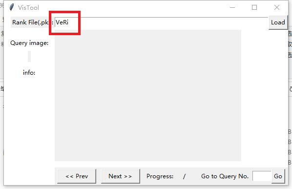
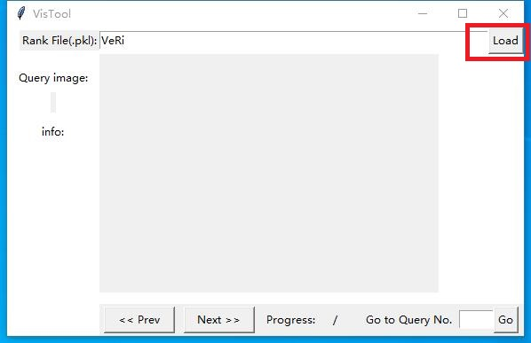
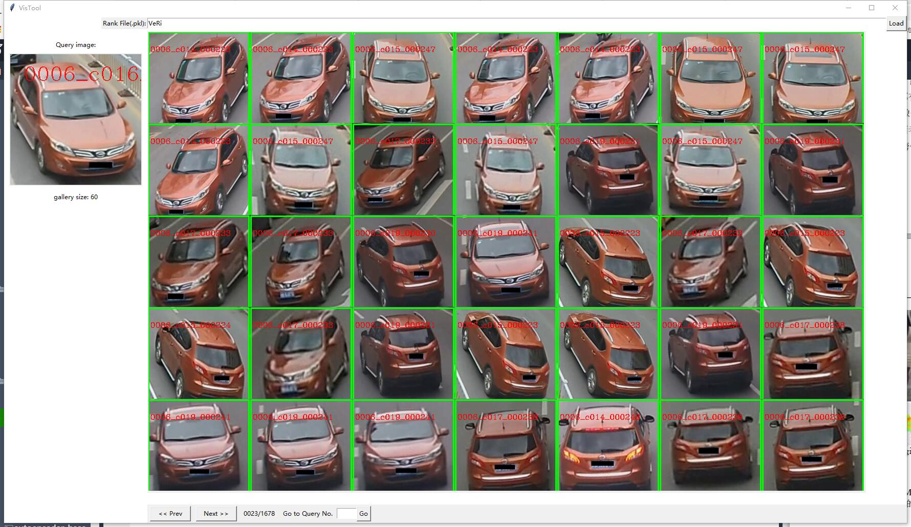
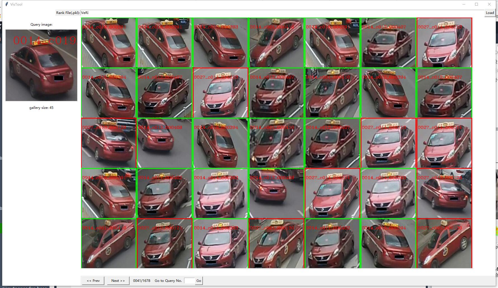
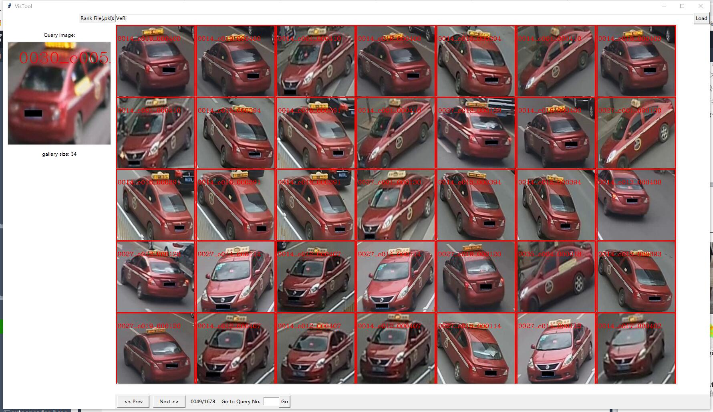
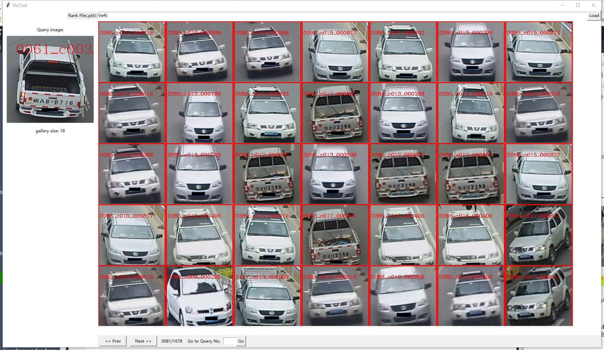

# reid visual system

## 使用方法
1. 参考[https://github.com/BravoLu/open-VehicleReID/blob/master/evaluators/base.py](https://github.com/BravoLu/open-VehicleReID/blob/master/evaluators/base.py)#74~99行生成对应的.pkl文件。

2. 运行脚本，并指定数据集的位置
```shell
python visualize.py -data ${data_path}
```

3. 输入生成的.pkl文件，不带后缀，然后点击load键。




4. 可视化结果展示



